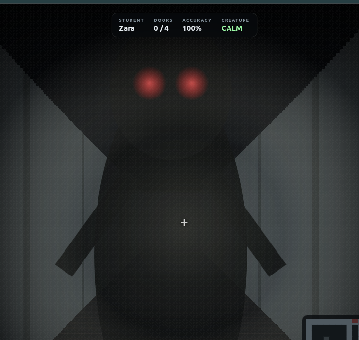

# The Abandoned School — 3D Learning Horror



## Story

The school has been abandoned for years.

The lights are mostly dead, the classrooms are locked, and something is still walking the halls.

You enter after dark and quickly discover that the main exit has sealed behind you. The only way out is through the school itself.

Four classroom doors stand between you and freedom:

- **Math**
- **Reading**
- **Science**
- **History**

Each classroom is protected by an old electronic lock. To open a door, you must answer its subject questions correctly.

But you are not alone.

A creature is hunting you through the hallways. At first it moves slowly, giving you time to explore and find the classrooms. Every wrong answer makes the creature faster. The more mistakes you make, the less time you have to think, hide, and move.

To escape, you must unlock all four classrooms and then reach the **north exit** before the creature catches you.

Your final grade is based on your answer accuracy, and the game saves your result whether you escape or get caught.

## Objective

Unlock all four classroom doors and escape through the north exit.

Each classroom requires **3 correct answers**, meaning you need at least **12 correct answers** to fully unlock the school.

Wrong answers do not immediately end the game, but they make the creature increasingly dangerous.

## Features

- First-person 3D school environment
- Dark horror atmosphere and flashlight effect
- Student name entry
- Math, Reading, Science, and History questions
- 3 correct answers required per classroom
- Creature pathfinding through the school
- Creature gets faster after every wrong answer
- Sprinting
- Mouse look
- Classroom interaction system
- Minimap
- Escape objective
- Automatic letter grades
- Saved grade history
- CSV grade export
- Grades are saved even if the player gets caught

## Controls

- `W` / `S` — move forward and backward
- `A` / `D` — move left and right
- Mouse — look around
- `Shift` — sprint
- `E` — interact with a classroom door
- `M` — toggle minimap
- `Esc` — release the mouse

## Grading

Your grade is based on answer accuracy:

```text
Score = Correct Answers / Total Answer Attempts × 100
```

| Score | Grade |
|------:|:-----:|
| 90–100% | A |
| 80–89% | B |
| 70–79% | C |
| 60–69% | D |
| Below 60% | F |

The game records:

- Student name
- Letter grade
- Percentage score
- Correct answers
- Wrong answers
- Whether the student escaped or was caught
- Completion time
- Date played

## Run on Linux / Pop!_OS

```bash
chmod +x start.sh
./start.sh
```

The launcher automatically looks for an available local port.

## Run on macOS

Double-click:

```text
start.command
```

Or run:

```bash
chmod +x start.command
./start.command
```

## Manual Start

```bash
python3 -m http.server 8099 --bind 127.0.0.1
```

Then open:

```text
http://127.0.0.1:8099
```

## Grade Storage

Grades are stored locally in the browser using `localStorage`.

Open **View Grades** from the game menu to see previous attempts or export them as a CSV file.
