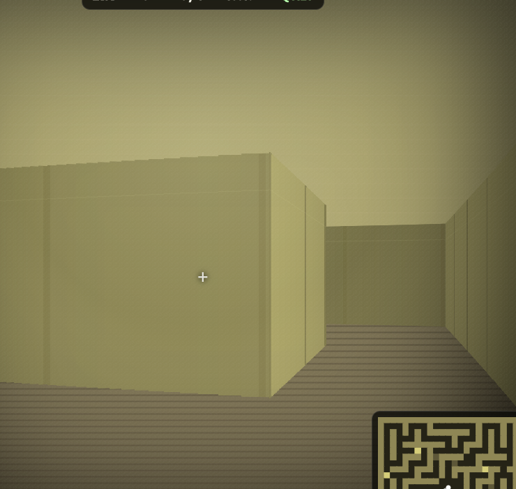
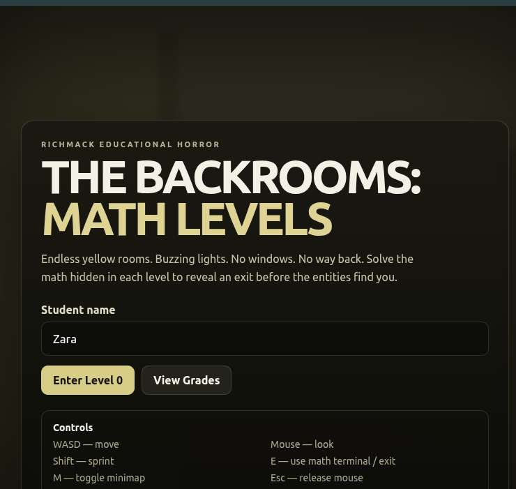

# The Backrooms: Math Levels — Survival Doors Edition

## Screenshots

### Gameplay



### Title Screen



A standalone first-person 3D educational horror game set in endless yellow hallways.

## Story

You fall through reality and wake up beneath fluorescent lights that never stop buzzing.

The carpet is damp. The yellow walls repeat forever. Every corridor looks familiar, but none of them lead back to where you started.

You are inside **The Backrooms**.

The only way deeper — and eventually out — is to solve the math terminals hidden across each level. Every level focuses on a different kind of math:

1. Fractions
2. Equations
3. Percentages
4. Geometry
5. Ratios & Rates
6. Mixed Math

Solve all four main terminals on a level and a hidden exit appears.

But the halls now contain something else: **locked supply doors**.

Every supply door has a simple math question. Answer correctly and the door opens, revealing something that may help you survive. Answer incorrectly and the door stays locked — and the entity hears the keypad.

## Survival Items

Supply doors can contain:

- ⚡ **Energy Drink** — increases sprint speed
- 🔋 **Flashlight Battery** — makes the halls easier to see
- 📻 **Noise Decoy** — pushes the entity farther away
- 🧿 **Protective Charm** — blocks one capture
- 💉 **Adrenaline Shot** — increases movement speed
- 🧯 **Entity Repellent** — slows the entity

The supply-door questions are deliberately simpler than the main level questions.

## The Entity

The entity has been redesigned to be more disturbing:

- unnaturally long arms and legs
- distorted pale face
- black eye sockets
- glowing red eyes
- oversized vertical mouth
- visible teeth
- visual distortion when it gets close
- stronger screen shake and darkness at close range
- faster movement after wrong answers

If you have a Protective Charm, it will shatter and save you from one capture.

## More 3D Hallways

The ray-cast environment now has:

- deeper perspective
- ceiling and floor gradients
- ceiling trim
- baseboards
- wallpaper seams
- wall staining
- dimensional pillars and room dividers
- recessed supply doors
- glowing door keypads
- fluorescent-light shading
- carpet perspective lines
- stronger distance lighting and shadows

## Main Math Levels

Each level requires four main terminal problems before the exit appears.

Wrong main-terminal answers make the entity significantly faster.

## Supply Door Questions

Every unopened supply door has its own simple question, such as:

- 2 + 3
- 10 - 4
- 3 × 4
- 12 ÷ 3
- half of 10
- 25 + 25
- half of 8
- 20% of 10

Correct answers unlock the survival item behind the door.

## Controls

- `WASD` / arrow keys — move
- Mouse — look around
- `Shift` — sprint
- `E` — use terminal, supply door, or exit
- `M` — toggle minimap
- `Esc` — release mouse

## Student Grades

The game records:

- student name
- letter grade
- percentage score
- correct answers
- wrong answers
- highest level
- number of supply doors opened
- escaped / caught result
- elapsed time
- date

Grades can be exported as CSV.

## Start on Linux / Pop!_OS

```bash
chmod +x start.sh
./start.sh
```

## Start on macOS

```bash
chmod +x start.command
./start.command
```

## Manual Start

```bash
python3 -m http.server 8100 --bind 127.0.0.1
```

Then open:

```text
http://127.0.0.1:8100
```