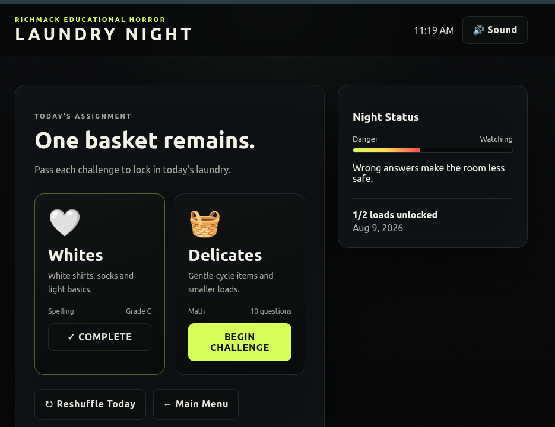

# Laundry Night

A creepy educational laundry-shuffle game.

## Screenshot



## What it does

- Selects **2 laundry loads each day**.
- Gives each load a **10-question math or spelling challenge**.
- Saves the player's score and letter grade.
- Saves completed laundry in the browser using `localStorage`.
- Loads that have not been completed recently receive a higher chance of being picked.
- Wrong answers raise the game's danger level and make the laundry room creepier.
- Includes a manual **Reshuffle Today** button.

## Included laundry categories

- Darks
- Whites
- Towels
- Bedding
- Kids' Clothes
- Parents' Clothes
- Kitchen Towels
- Delicates

## Run it

You can open `index.html` directly in a browser.

For a local web server:

```bash
cd ~/laundry-night
python3 -m http.server 8113
```

Then open:

```text
http://localhost:8113
```

## Customize the loads

Open `game.js` and edit the `LOADS` array near the top of the file.

Each load has:

```js
{ id:'towels', name:'Towels', icon:'🛁', subject:'Math', skill:'addition', desc:'Bath towels...' }
```

Supported math skills are:

- `addition`
- `multiplication`
- `division`
- `fractions`
- `mixed`

Use `subject:'Spelling'` and `skill:'spelling'` for spelling loads.
