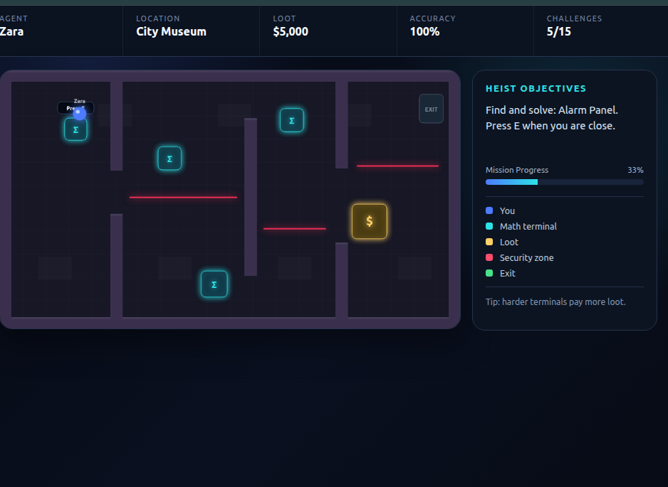

# 🕵️ Math Heist

**Math Heist** is an educational browser game where players break into banks, museums, and high-security vaults by solving math problems.

Correct answers unlock security systems, disable defenses, and crack safes. Harder problems earn better loot.

## 🎮 Gameplay



## 🏦 Missions

### Metro Bank
Practice **addition and subtraction** while breaking through the bank's security systems.

### City Museum
Solve **multiplication and division** problems to bypass alarms and steal valuable museum loot.

### Master Vault
Take on **mixed, multi-step math problems** to defeat the strongest security system and crack the final vault.

## ✨ Features

- 3 heist locations
- 15 total math challenges
- Addition and subtraction
- Multiplication and division
- Multi-step math problems
- WASD and Arrow Key movement
- Press **E** to interact with terminals, safes, and exits
- Moving laser security systems
- Harder problems give more loot
- Correct-answer streak bonuses
- Player name entry
- Accuracy tracking
- A–F final grade
- Downloadable grade report
- Runs locally in a modern web browser
- No external dependencies required

## 🕹️ Controls

| Control | Action |
| --- | --- |
| `W A S D` | Move |
| `Arrow Keys` | Move |
| `E` | Interact |
| `Enter` | Submit a math answer |

## 🚀 Run the Game

You can open `index.html` directly in a modern browser.

For best results, run a local web server from inside the project folder:

```bash
python3 -m http.server 8080
```

Then open:

```text
http://127.0.0.1:8080
```

## 📊 Grading

The game tracks:

- Correct answers
- Total attempts
- Accuracy
- Best correct-answer streak
- Total loot earned

At the end of the heist, the player receives an **A–F grade** and can download a grade report.

## 📁 Project Files

```text
math-heist/
├── index.html
├── game.js
├── style.css
├── README.md
└── screenshots/
    └── math-heist-gameplay.png
```

## 🧠 Educational Goal

Math Heist turns math practice into a mission-based game. Students solve problems as part of the gameplay instead of answering questions from a traditional worksheet.

The increasing security levels introduce progressively harder problems while the loot system rewards accuracy and successful problem solving.
