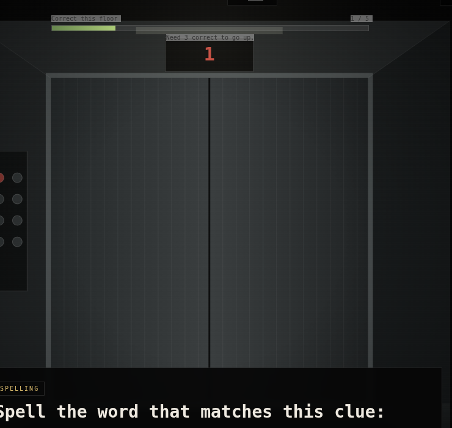

# Scary Elevator 3D

A rebuilt version of Scary Elevator with a more immersive elevator cab and corrected spelling system.


## Screenshot



## Major changes

- 3D-style perspective elevator interior
- Brushed-metal walls and doors
- Animated elevator movement and cab shake
- Mouse parallax so the room shifts as you look around
- Elevator doors physically slide open and closed
- Wrong answers reveal full creepy rooms beyond the elevator:
  - Parking garage
  - Hotel hallway
  - Basement
  - Half-height room
  - Red room
  - Mirror elevator room
  - Endless hallway
- Flickering overhead light
- Floor display changes for creepy floors

## Spelling fix

The spelling question no longer displays the answer in the prompt.

Spelling now uses:

1. **Choose the correctly spelled word** from realistic misspellings, using a definition clue.
2. **Type the word** from a definition and partial first/last-letter clue.

## Education

Each normal floor has exactly 5 questions.

Modes:
- Math + Spelling
- Math Only
- Spelling Only

Difficulty:
- Easy
- Medium
- Hard

Reach Floor 10 to escape.

## Run

If the ZIP is in your home folder:

```bash
cd ~
unzip scary-elevator-3d.zip
cd scary-elevator-3d
python3 -m http.server 8140
```

Open:

```text
http://127.0.0.1:8140
```
